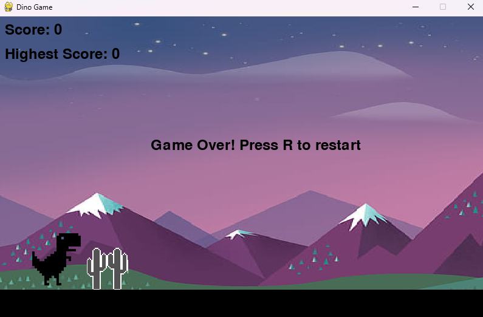

# 🦖 Dino Game
Welcome to **Dino Game**, a fun and engaging side-scrolling game built using **Python** and **Pygame**. In this game, you control a dinosaur that must jump over obstacles and survive as long as possible, all while keeping track of your score and setting new records!

## 🚀 Features

- **Smooth Gameplay:** Responsive controls and fluid animations.
- **Dynamic Obstacles:** Randomly generated obstacles with increasing difficulty.
- **Parallax Background:** Immersive parallax scrolling background.
- **Jump Mechanics:** Gravity-driven jumps with realistic physics.
- **Background Music & Sound Effects:** Enhance the experience with background music and jump sound effects.
- **Score Tracking:** Track your score and highest score with each play.
- **Game Over & Restart:** Immediate game over detection and a quick restart option.

## 🎮 How to Play

- **Jump:** Press `SPACE` to make the dinosaur jump over the obstacles.
- **Restart:** Press `R` to restart the game after a game over.

Your goal is to survive as long as possible by jumping over obstacles. Every obstacle cleared increases your score, so keep going and beat your high score!
